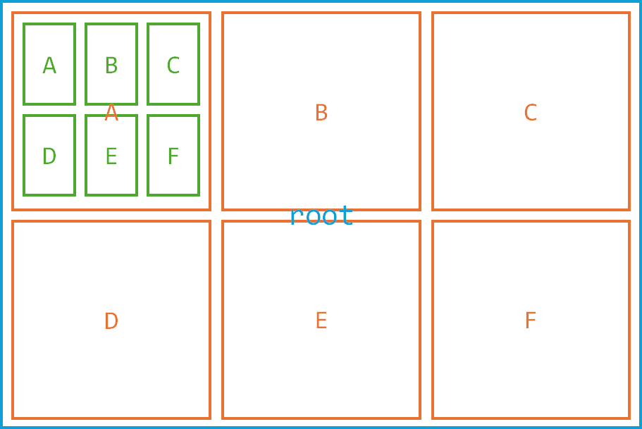

# Goals and Overview

In this PA (Programming Assignment) you will:

- Learn about implementing a 6-ary tree  
- Learn to design more complex recursive algorithms  
- Learn about a possible method of image compression using space-partitioning trees  

---

## Part 1: The `HexTree` Class

A `HexTree` is a 6-ary tree whose nodes represent rectangular regions of a PNG image. The root represents the entire image. The six children (referred to as **A, B, C, D, E, and F**, if present) of any node `nd` represent up to six rectangular partitions of `nd`'s image region.

Every node also contains:

- A pixel representing the average colour of the pixels in its rectangular region  
- The upper-left image coordinates of its rectangular region  
- The lower-right image coordinates of its rectangular region  

### Building a `HexTree`

The constructor of the `HexTree` receives a PNG image of non-zero dimensions.

The region for each node is split vertically as evenly as possible into upper and lower regions, and each upper and lower region is horizontally split symmetrically, into three (or two, or even one) smaller regions. See the documentation in `hextree.h` for details about how to determine the dimensions and coordinates of the split pieces.

A freshly constructed `HexTree` will have a leaf node corresponding to each individual pixel of the original image.

For example, a large image will be progressively split into the regions shown in the image below:

> *(Each different colour group represents the children of a larger node. Note that for clarity, not all children of all nodes are shown, but nodes will continue to be split in this way as long as they are able.)*

> *(In many cases—especially regions with extremely small widths and/or heights—it may be impossible to assign image regions to all upper and lower pointers, or to all left/middle/right pointers. Refer to the documentation in `hextree.h` for splitting requirements in these situations.)*

### Functions to Complete

In class `HexTree`:

- `HexTree(const PNG& imIn)`  
- `HexTree& operator=(const HexTree& rhs)`  
- `PNG Render(bool fulldepth, unsigned int maxlevel) const`  
- `void FlipHorizontal()`  
- `void Clear()`  
- `void Copy(const HexTree& other)`  
- `Node* BuildNode(const PNG& img, pair ul, pair lr)`  

> Many of the functions above will require private recursive helpers. It is up to you to add the declarations into `hextree-private.h`, giving them appropriate signatures, and implementing them in `hextree.cpp`.

**Advice:** The constructor (which will use `BuildNode`) is critical for all of the other tree functionality. It is recommended to focus your efforts into first correctly implementing `BuildNode`, which will be used in all of the testing functions.

---

## Part 2: Image Compression Using `HexTrees`

Thanks to the hierarchical structure of the tree, and because each node stores the average colour of its rectangular region, we can **trim** portions of the tree that represent areas without fine pixel-level detail.

This is achieved by the `Prune` function, which receives a **tolerance** parameter. This function attempts, starting near the top of a freshly built tree, to remove all of the descendants of a node if **all of the leaf nodes** below the current node have colour within tolerance of the node's average colour.

This way, areas of the image with little colour variability can be replaced with a single rectangle of solid colour, while areas with fine pixel detail can remain detailed.

The image quality may be reduced, but:
- Fine details will still be visible  
- The structure size used to store the image data will be reduced  

### Example

**Original image (upscaled):**  


**Rendered image after pruning at tolerance 0.05 (upscaled):**


- Tree constructed from the original image contains **107,635 nodes**, of which **57,344** are leaf nodes (one per pixel)  
- Tree after pruning contains **30,625 nodes**, of which **18,577** are leaf nodes  

### Function to Complete

In class `HexTree`:

- `void Prune(double tolerance)`

> It may be helpful to write **two recursive helpers** for this function.

---

## Testing

We have provided a file `main.cpp` which writes your output images to the `outputs` folder along with some diagnostic prints to the console.  

**This is not a complete test of functionality!**  
You are **highly encouraged** to add your own testing code to this file.

### Compile the executable:

```bash
make
```
You can run the given tests using the command:

./pa3

